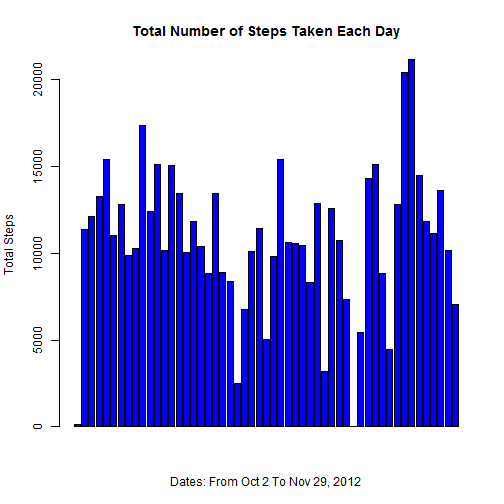
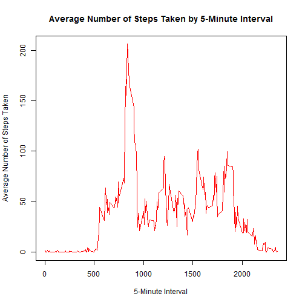
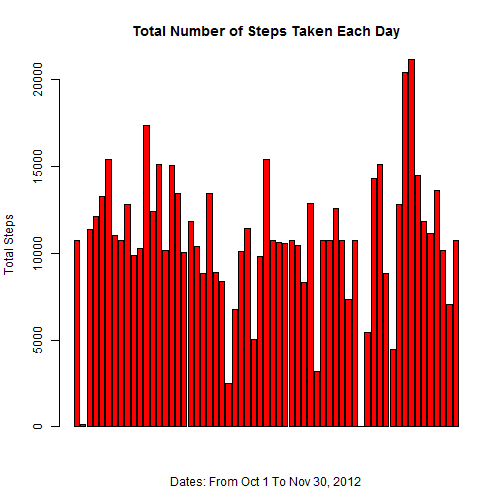
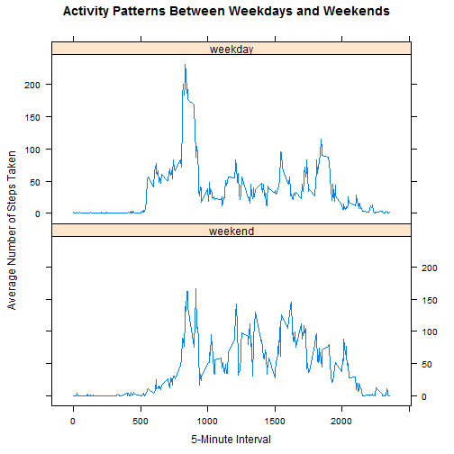

# Reproducible Research: Peer Assessment 1
============================================

This assignment makes use of data from a personal activity monitoring device. This device collects data at 5 minute intervals through out the day. The data consists of two months of data from an anonymous individual collected during the months of October and November, 2012 and include the number of steps taken in 5 minute intervals each day.

## Loading and preprocessing the data

The following code is to load the dataset in R.


```r
activityData <- read.csv("./activity.csv", head = TRUE)
rowNum1 <- nrow(activityData)
```

The dataset has **17568** rows.

The variables included in this dataset are:

- **steps**: Number of steps taking in a 5-minute interval (missing values are coded as NA)
- **date**: The date on which the measurement was taken in YYYY-MM-DD format
- **interval**: Identifier for the 5-minute interval in which measurement was taken

As the variable **steps** has missing values coded as **NA**, the following code removes all rows with **NA** values for data analysis purpose.


```r
cleanData <- na.omit(activityData)
rowNum2 <- nrow(cleanData)
```

Now, after omitting the rows with **NA** values, the total number of rows becomes **15264**.

Next, there is a need to unfactor the data frame. The code below will convert all values in **activityData** to character.


```r
cleanData <- data.frame(lapply(cleanData, as.character), stringsAsFactors = FALSE)
```

The values of the variable **date** are converted from character to date as follows:


```r
cleanData$date <- as.Date(cleanData$date, "%Y-%m-%d")
```

Similarly, the values of the variable **steps** are converted from character to numeric as follows:


```r
cleanData$steps <- as.numeric(cleanData$steps)
```

And finally, the values of **steps** are grouped by **date**.


```r
groupedSum <- aggregate(steps ~ date, cleanData, sum)
```

## What is mean total number of steps taken per day?

The histogram of the total number of steps taken each day is shown below, by running the following code. *Note: Strictly speaking, it may not be actually a histogram but rather a bar graph.*


```r
barplot(groupedSum$steps, main = "Total Number of Steps Taken Each Day", xlab = "Dates: From Oct 2 To Nov 29, 2012",ylab = "Total Steps", col = "blue")
```

 

The mean and median of the total number of steps taken per day are obtained from the following codes. 


```r
stepMean <- format(mean(groupedSum$steps), big.mark = ",")
stepMed <- format(median(groupedSum$steps), big.mark= ",")
```

The mean of the total number of steps taken per day is **10,766**, and the median is **10,765**.

## What is the average daily activity pattern?

A time series plot of the 5-minute interval (x-axis) and the average number of steps taken, averaged across all days (y-axis) will be created, but before that, there is a need to convert the interval values from character to numeric, and group the average number of steps by the interval.


```r
cleanData$interval <- as.numeric(cleanData$interval)
groupedMean <- aggregate(steps ~ interval, cleanData, mean)
```

Then, the codes to plot the time series is:


```r
plot(groupedMean$interval, groupedMean$steps, xlab = "5-Minute Interval", ylab = "Average Number of Steps Taken", type = "l", col = "red")
title(main = "Average Number of Steps Taken by 5-Minute Interval")
```

 


```r
m <- max(groupedMean$steps)
idx <- match(m, groupedMean$steps)
maxInterval <- groupedMean[idx, 1]
```

The 5-minute interval with the maximum value of the average number of steps is **835**. This can be obtained by running the codes above.

## Imputing missing values

The total number of missing values in the dataset (i.e.the total number of rows with NAs) is **2304**.

The missing values in the dataset will be filled with the mean of the corresponding 5-minute interval.

The following codes creates a new dataset called **filledData** that is equal to the original dataset but with the missing data filled in.


```r
activityData <- data.frame(lapply(activityData, as.character), stringsAsFactors = FALSE)
activityData$date <- as.Date(activityData$date, "%Y-%m-%d")
activityData$steps <- as.numeric(activityData$steps)
activityData$interval <- as.numeric(activityData$interval)
filledData <- activityData
for (i in 1:nrow(filledData)) {
        if(is.na(filledData[i, 1])) {
		idx <- match(filledData[i, 3], groupedMean$interval)
		filledData[i, 1] <- groupedMean[idx, 2]	
	}
}
```

Before making a histogram of the total number of steps taken each day with the new dataset, the total number of steps need again to be grouped by **date**.


```r
groupedFill <- aggregate(steps ~ date, filledData, sum)
```

The code for the histogram is as follows:


```r
barplot(groupedFill$steps, main = "Total Number of Steps Taken Each Day", xlab = "Dates: From Oct 1 To Nov 30, 2012",ylab = "Total Steps", col = "red")
```

 

The new mean and median of the total number of steps taken per day are obtained from the following codes.

```r
fillMean <- format(mean(groupedFill$steps), big.mark = ",")
fillMed <- format(median(groupedFill$steps), big.mark = ",")
```

The mean and median total number of steps taken per day are **10,766** and **10,766** respectively.These numbers compared with those computed previously with the dataset omitting the missing values are almost the same. 

Based on the above result and taken as a whole, there is no impact of imputing missing data on the estimates of the total daily number of steps. 

## Are there differences in activity patterns between weekdays and weekends?

The following codes will create a new variable called **day** in the dataset with the filled-in missing values.


```r
filledData$day <- weekdays(filledData$date)
for (i in 1: nrow(filledData)) {
        if (filledData[i, 4] == "Saturday" || filledData[i, 4] == "Sunday") {
		filledData[i, 4] <- "weekend"
	}
	else {
		filledData[i, 4] <- "weekday"
	}
}
```

The new variable needs to be converted into factor.


```r
filledData$day <- as.factor(filledData$day)
```

Before making a panel plot, it is necessary to divide the dataset with the filled-in missing values into two subsets, one containing all weekdays, and the other all weekends.


```r
weekdaySteps <- subset(filledData, filledData$day == "weekday")
weekendSteps <- subset(filledData, filledData$day == "weekend")
```

Each subset category will be grouped by **interval** for the average number of steps taken, averaged across all weekday days or weekend days.


```r
groupedWeekday <- aggregate(steps ~ interval, weekdaySteps, mean)
groupedWeekend <- aggregate(steps ~ interval, weekendSteps, mean)
```

Then, the variable **day** is added to each subset, and they are combined again together.


```r
groupedWeekend$day <- "weekend"
groupedWeekday$day <- "weekday"
groupedData <- rbind(groupedWeekend, groupedWeekday)
```

The code for making the panel plot containing a time series plot is as follows. The **lattice** plotting system is used.


```r
library(lattice)
xyplot(steps ~ interval | day, data = groupedData, type = "l", layout = c(1, 2), as.table = TRUE, xlab = "5-Minute Interval", ylab = "Average Number of Steps Taken", main = "Activity Patterns Between Weekdays and Weekends")
```

 
